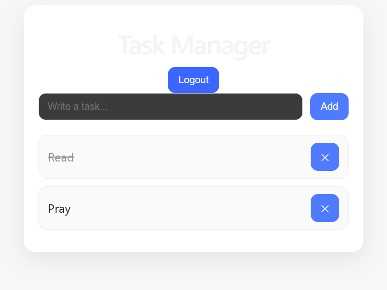

# 👩🏽‍💻 Author

**Eunice De Grace FMUKAM NGADJOU**

Computer Engineering Technology Student  
Northern Alberta Institute of Technology (NAIT)

📍 Edmonton, Alberta, Canada

GitHub:
https://github.com/EuniceFMK

LinkedIn:
https://www.linkedin.com/in/eunice-fmukam-21a909362/

# 📌 Student Task Manager

A full-stack task management web application built with **React.js, Flask, and SQLAlchemy**.  
The application allows users to create accounts, authenticate securely, and manage their personal tasks through a RESTful API.

This project demonstrates full-stack development, REST API design, database integration, authentication, and frontend-backend communication.

---

# 🚀 Live Demo

## Frontend
🌐 https://student-task-manager-api-two.vercel.app/

## Backend API
🌐 https://student-task-manager-api-3.onrender.com

---

# 📸 Application Preview




---

# ✨ Features

## 🔐 User Authentication

- User registration
- Secure login system
- Password hashing using BCrypt
- JWT-based authentication
- Protected API routes
- Each user can only access their own tasks

---

## 📋 Task Management

Users can:

- Create tasks
- View their tasks
- Mark tasks as completed
- Update task information
- Delete tasks

---

## 🔒 Security

Implemented:

- JWT Authentication
- Password encryption with BCrypt
- Protected CRUD operations
- User-based data filtering

---

# 🛠️ Tech Stack

## Frontend

- React.js
- Vite
- JavaScript (ES6+)
- CSS3
- Fetch API
- LocalStorage for token management

---

## Backend

- Python
- Flask
- Flask SQLAlchemy
- Flask JWT Extended
- Flask BCrypt
- Flask CORS

---

## Database

- SQLite
- SQLAlchemy ORM
- Relational database design

---

## Tools

- Git
- GitHub
- VS Code
- Postman

---

## Deployment

Frontend:
- Vercel

Backend:
- Render

Version Control:
- GitHub

---

# 🏗️ Project Architecture

```
student-task-manager/

│
├── frontend/
│   │
│   ├── src/
│   │   ├── App.jsx
│   │   ├── main.jsx
│   │   └── App.css
│   │
│   └── package.json
│
│
├── backend/
│   │
│   ├── app.py
│   ├── requirements.txt
│   └── tasks.db
│
└── README.md
```

---

# 🔄 Application Flow

```
React Frontend
       |
       |
       | HTTP Requests (Fetch API)
       |
       ↓
Flask REST API
       |
       |
       ↓
SQLAlchemy ORM
       |
       |
       ↓
SQLite Database
```

---

# 📡 API Endpoints

## Authentication

| Method | Endpoint | Description |
|--------|----------|-------------|
| POST | /register | Create a new user |
| POST | /login | Authenticate user and receive JWT token |

---

## Tasks

| Method | Endpoint | Description |
|--------|----------|-------------|
| GET | /tasks | Retrieve user's tasks |
| POST | /tasks | Create a new task |
| PUT | /tasks/:id | Update a task |
| DELETE | /tasks/:id | Delete a task |

---

# ⚙️ Installation & Setup

## 1. Clone Repository

```bash
git clone https://github.com/EuniceFMK/student-task-manager-api.git

cd student-task-manager-api
```

---

# Backend Setup

Navigate to backend folder:

```bash
cd backend
```

Install dependencies:

```bash
pip install -r requirements.txt
```

Run Flask server:

```bash
python app.py
```

Backend will run on:

```
http://127.0.0.1:10000
```

---

# Frontend Setup

Navigate to frontend folder:

```bash
cd frontend
```

Install packages:

```bash
npm install
```

Start React application:

```bash
npm run dev
```

Frontend will run on:

```
http://localhost:5173
```

---

# 🧪 API Testing

The API was tested using:

- Postman
- Browser Developer Tools
- React frontend integration

Example login request:

```json
POST /login

{
  "email": "user@test.com",
  "password": "123456"
}
```

Response:

```json
{
  "message": "Login successful",
  "token": "JWT_TOKEN",
  "user_id": 1
}
```

---

# 🗄️ Database Models

## User

| Field | Type |
|------|------|
| id | Integer |
| email | String |
| password | Hashed String |

---

## Task

| Field | Type |
|------|------|
| id | Integer |
| title | String |
| done | Boolean |
| user_id | Foreign Key |

Relationship:

```
User 1 -------- * Tasks
```

A user can have multiple tasks.

---

# 🚧 Future Improvements

Possible improvements:

- Add user profile management
- Add task categories
- Add deadlines and reminders
- Add search and filtering
- Add PostgreSQL database migration
- Improve UI/UX design
- Add automated testing
- Add Docker support

---


# 🎯 Project Purpose

This project was developed to practice and demonstrate:

- Full-stack web development
- REST API creation
- Database management
- Authentication systems
- Frontend/backend integration
- Software debugging and deployment
